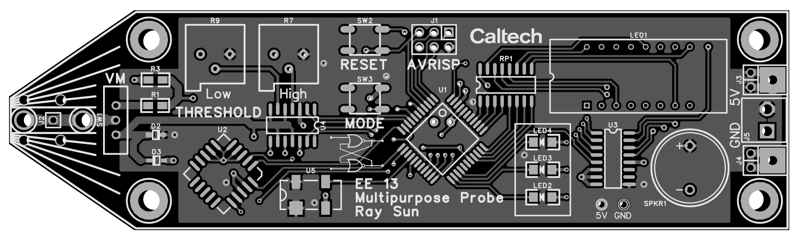
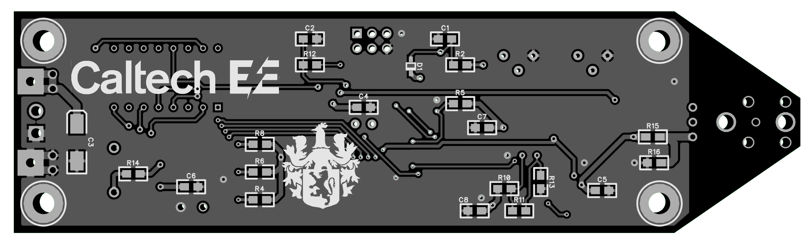

# ee13-logic-probe

Multipurpose logic probe board for EE 13 at Caltech

## Description
This is a 5V logic level probe constructed for the Electronic System Prototyping course (EE 13) at Caltech. It is based on an AT90S441 AVR with a PAL16V8 for preprocessing of the input. The probe may be used as a voltmeter (0 - 5V) and simple logic analyzer that displays frequency or duty cycle on a set of three seven-segment displays.

Designed with DipTrace v.3.3.1.0. Gerber files may be found in `/gerber`.

## Author
- Ray Sun - Undergraduate, Electrical Engineering, Caltech, Class of 2020

## Acknowledgments
* [Glen George](https://directory.caltech.edu/personnel/gleng) designed the multipurpose probe circuit and facilitated fabrication of the board.

## Links
* [EE 13 Fall 2018 Course Webpage](http://wolverine.caltech.edu/ee13/)
* [Binario Board Schematic](http://wolverine.caltech.edu/ee13/projects/probe/5xprobe6sch.pdf)
